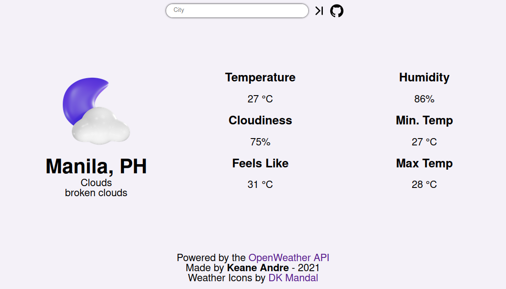

  <h1 align="center">Weather App</h1>
  

    <strong>This was the fifth project/task for the Full-stack JavaScript path for The Odin Project. Its main functionalities are: to fetch and display weather forecast data from an API, and dynamically change the display according to the forecast. It is also fully responsive.</strong>
       
    <a href="https://keaneatl.github.io/weather-app/" target="_blank"><strong>Live Preview »</strong></a>
      
  

<h2 style="display: inline-block">Table of Contents</h2>
<ol>
  <li>
    <a href="#about-the-project">About The Project</a>
    <ul>
      <li><a href="#instructions">Instructions</a></li>
      <li><a href="#made-with">Made With</a></li>
      <li><a href="#things-i-learned">Things I Learned</a></li>
      <li><a href="#areas-of-improvement">Areas of Improvement</a></li>
    </ul>
  </li>

  <li><a href="#disclaimer">Disclaimer</a></li>
  <li><a href="#contact">Contact</a></li>
</ol>

## About The Project

### Instructions

The <a href="https://www.theodinproject.com/paths/full-stack-javascript/courses/javascript/lessons/weather-app">instructions</a> given for this task as per The Odin Project

1. Set up a blank HTML document with the appropriate links to your JavaScript and CSS files.
2. Write the functions that hit the API. You’re going to want functions that can take a location and return the weather data for that location. For now, just console.log() the information.
3. Write the functions that process the JSON data you’re getting from the API and return an object with only the data you require for your app.
4. Set up a simple form that will let users input their location and will fetch the weather info (still just console.log() it).
5. Display the information on your webpage!
6. Add any styling you like!
7. Optional: add a ‘loading’ component that displays from the time the form is submitted until the information comes back from the API.
8. Push that baby to github and share your solution below!

### Made With

1. HTML
2. CSS
3. JavaScript
4. OpenWeather API
5. JSON
6. Webpack

### Things I Learned

1. Asynchronous Code
2. Promises
3. Async/Await
4. Working with APIs

### Areas of improvement

1. A loading screen while fetching the data
2. Background changes depending on the forecast

## Disclaimer

The resources I used, specifically the custom fonts installed, backgrounds, pictures, and the svg icons are only utilized for personal use, and not otherwise.

## Contact

Keane Andre - @keaneatl (Instagram, Facebook, Twitter) - <a href="mailto:kyntltntn@protonmail.com">kyntltntn@protonmail.com</a>
